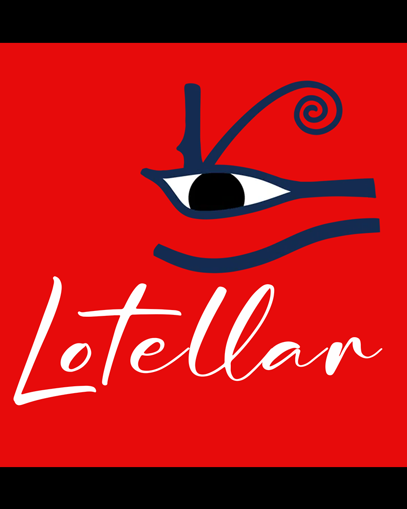
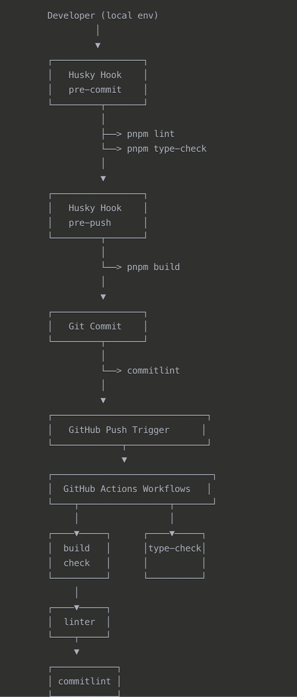

[](https://github.com/Akifcan/forwardie/actions/workflows/build.yml)
[](https://github.com/Akifcan/forwardie/actions/workflows/commitlint.yml)
[](https://github.com/Akifcan/forwardie/actions/workflows/format.yml)
[](https://github.com/Akifcan/forwardie/actions/workflows/type-check.yml)

- 🧪 **Live Demo**: [https://lotellar.netlify.app](https://lotellar.netlify.app)
- 🎥 **Watch App Video**: [Here]([https://drive.google.com/file/d/1tK4jF9rPK7zIXG57brtX9gvvJ24oN21O/view?usp=sharing](https://drive.google.com/file/d/1sF9iiLQ0akKjencyfvds5udjKxBI3Ni5/view?usp=sharing))
- 🧪 **Pitch Deck Presentation**: [Here](https://drive.google.com/file/d/1tK4jF9rPK7zIXG57brtX9gvvJ24oN21O/view?usp=sharing)
- 📕 **Gitbook**: [https://overblock.gitbook.io/lotellar/incentivized-lotteries](https://overblock.gitbook.io/lotellar/incentivized-lotteries)

# Stellar Hack Pera

<p float="left" align="center">
  
  
  
</p>


# Lotellar – Lottery System

## 🧠 Summary
Lotellar is a fully decentralized Web3 application built on the Stellar Soroban smart contract platform that enables trustless lotteries and transparent voting. Designed with transparency, user-friendliness, and accessibility in mind, Lotellar aims to democratize participation in public draws and polls using blockchain-native identity and randomness.

## 🔧 Key Features
- 🎲 Lottery Mechanism: Provably fair lottery draws using on-chain pseudo-randomness via Soroban's vm::random, offering a VRF-like experience.
- 🔐 Passkey Authentication: Uses modern Passkey/WebAuthn authentication to provide seamless, passwordless login tied to a user's device.
- 🔗 Freighter Wallet Integration: Interact with Soroban smart contracts directly via Freighter for signing transactions.

## 🧰 Installation & Usage

This project uses **[pnpm](https://pnpm.io/)** as the package manager.  
Make sure you have it installed globally:

```bash
npm install -g pnpm
```

### 🔧 1. Install Dependencies
```bash
pnpm install
```


### ⚙️ 2. Set Up Environment Variables
```bash
cp .env.example .env
```
📝 Fill in the required values in your .env file before running the app.

### 🧪 3. Run in Development Mode
```bash
pnpm dev
```


### 🏗️ 4. Build for Production
```bash
pnpm build
```

### ⚙️ Deployment & CI/CD Workflow
```bash
pnpm start
```
---

## ⚙️ Deployment & CI/CD Workflow

Lotellar uses a robust CI/CD setup combining **local pre-commit checks** and **GitHub Actions workflows** to ensure code quality, type safety, and build integrity before any deployment.

### 🔄 Local Development Pipeline (via Husky)

1. **Pre-commit Hook**
   - ✅ `pnpm lint` – Ensures code style and formatting
   - ✅ `pnpm type-check` – Verifies TypeScript correctness

2. **Pre-push Hook**
   - ✅ `pnpm build` – Builds the application to catch runtime or build-time errors before pushing

3. **Commit Message Check**
   - ✅ `commitlint` – Enforces conventional commit rules

---

### ☁️ GitHub Actions Workflows

Once code is pushed to GitHub, the following workflows run:

| Workflow Name       | Purpose                            |
|---------------------|------------------------------------|
| ✅ `build-check.yml` | Verifies production build integrity |
| 🧹 `linter.yml`       | Runs ESLint to ensure code style    |
| 🧠 `type-check.yml`   | Validates TypeScript types          |
| ✍️ `commitlint.yml`   | Checks commit messages              |



Workflow Steps

Developer (local env) - Developer works in local environment
Husky Hook (pre-commit) - Pre-commit checks

pnpm lint - Code style checking
pnpm type-check - Type checking


Husky Hook (pre-push) - Pre-push check

pnpm build - Project build check


Git Commit - Commit process

commitlint - Commit message format validation


GitHub Push Trigger - GitHub push trigger
GitHub Actions Workflows - Automated workflows

build check - Build validation
type-check - Type checking
linter - Code style checking
commitlint - Commit message validation

## Workflow Steps

- Developer (local env) - Developer works in local environment
- Husky Hook (pre-commit) - Pre-commit checks

- pnpm lint - Code style checking
- pnpm type-check - Type checking


- Husky Hook (pre-push) - Pre-push check

- pnpm build - Project build check


## Git Commit - Commit process

- commitlint - Commit message format validation


- GitHub Push Trigger - GitHub push trigger
- GitHub Actions Workflows - Automated workflows

- build check - Build validation
- type-check - Type checking
- linter - Code style checking
- commitlint - Commit message validation

---

### 🧭 CI/CD Flow Diagram

## 🛠️ Tech Stack
- Frontend: Next.js + TailwindCSS + TypeScript
- Smart Contracts: Rust (Stellar Soroban)
- Wallet & Signing: Freighter
- Authentication: Passkey/Freighter

## 📌 Use Cases
- Transparent NFT/Token lotteries
- Raffle giveaways for Web3 communities
- Web3-native anonymous polling

## 🌍 Vision
Lotellar envisions a world where trustless random draws and governance are not exclusive to tech-savvy crypto users but accessible to everyone, everywhere — leveraging blockchain not as a barrier, but as an enabler of fairness and autonomy.

## 👥 Team
Lotellar was built by a 4-person team of developers and designers with a shared passion for decentralized systems, trustless infrastructure, and accessible crypto UX. We combined our strengths in smart contract development, frontend engineering, product design, and blockchain architecture to deliver a seamless Web3 experience.

# Lotellar – Lottery System

## 🧠 Summary
Lotellar is a fully decentralized Web3 application built on the Stellar Soroban smart contract platform that enables trustless lotteries. Designed with transparency, user-friendliness, and accessibility in mind, Lotellar aims to democratize participation in public draws and polls using blockchain-native identity and randomness.

## 🔧 Key Features
- 🎲 Lottery Mechanism: Provably fair lottery draws using on-chain pseudo-randomness via Soroban's vm::random, offering a VRF-like experience.
- 🗳️ Voting System: Lightweight and anonymous voting modules ideal for DAOs, communities, and decentralized governance.
- 🔐 Passkey Authentication: Uses modern Passkey/WebAuthn authentication to provide seamless, passwordless login tied to a user's device.
- 🔗 Freighter Wallet Integration: Interact with Soroban smart contracts directly via Freighter for signing transactions.

## 🛠️ Tech Stack
- Frontend: Next.js + TailwindCSS + TypeScript
- Smart Contracts: Rust (Stellar Soroban)
- Wallet & Signing: Freighter
- Authentication: Passkey/Freighter

## 📌 Use Cases
- Transparent NFT/Token lotteries
- Raffle giveaways for Web3 communities
- Web3-native anonymous polling

## 🌍 Vision
Lotellar envisions a world where trustless random draws and governance are not exclusive to tech-savvy crypto users but accessible to everyone, everywhere — leveraging blockchain not as a barrier, but as an enabler of fairness and autonomy.

## 👥 Team
Lotellar was built by a 4-person team of developers and designers with a shared passion for decentralized systems, trustless infrastructure, and accessible crypto UX. We combined our strengths in smart contract development, frontend engineering, product design, and blockchain architecture to deliver a seamless Web3 experience.

Caner Yakupoğlu
Software Engineer, Founder OverBlock
10 years software development experience
5 years in blockchain
Running pos validators in cosmos based chains
Mina Navigator Grant
Yapı Kredi Bank Hackathon Winner
https://www.linkedin.com/in/CanerYakupoglu

Marsel Kerim Demir
Business Development

Akifcan Kara
Software Developer
5 years in software development

Emin Karagöz
Commumity creator
Smart Contract Developer
https://x.com/kaptan_web3


- **Overblocklabs Team**
